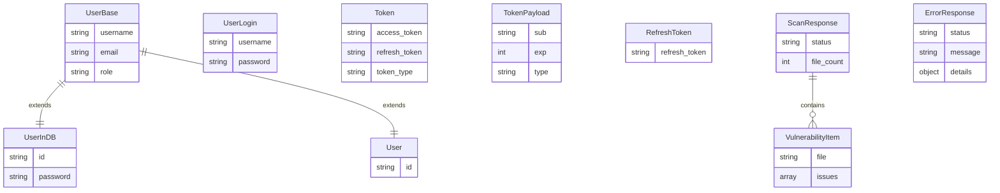

# API Flow Diagrams

This document contains detailed flow diagrams for the Security Testing API system.

## 1. Complete System Flow Overview


## 2. Authentication Flow Sequence


## 3. Security Testing Flow Sequence


## 4. JWT Token Lifecycle


## 5. File Processing Pipeline


## 6. Error Handling Flow


## 7. Data Model Relationships



## 8. Component Interaction Matrix

| Component | Auth Router | Security Router | Auth Service | Security Service | JWT Helper | Models |
|-----------|-------------|-----------------|--------------|------------------|------------|--------|
| **Auth Router** | - | ❌ | ✅ | ❌ | ✅ | ✅ |
| **Security Router** | ❌ | - | ❌ | ✅ | ❌ | ✅ |
| **Auth Service** | ✅ | ❌ | - | ❌ | ✅ | ✅ |
| **Security Service** | ❌ | ✅ | ❌ | - | ❌ | ✅ |
| **JWT Helper** | ✅ | ❌ | ✅ | ❌ | - | ✅ |
| **Models** | ✅ | ✅ | ✅ | ✅ | ✅ | - |

Legend:
- ✅ Direct interaction/dependency
- ❌ No direct interaction
- - Self reference

## 9. Security Vulnerability Detection Logic

```mermaid
flowchart TD
    A[File Extracted] --> B{Get File Extension}
    
    B --> C{Extension Type?}
    C -->|.py| D[Python Issues Pool]
    C -->|.js| E[JavaScript Issues Pool]
    C -->|.json| F[JSON Issues Pool]
    C -->|.html| G[HTML Issues Pool]
    C -->|.php| H[PHP Issues Pool]
    C -->|.java| I[Java Issues Pool]
    C -->|Other| J[Generic Issues Pool]
    
    D --> K[Hardcoded password<br/>Debug mode enabled<br/>Insecure random<br/>SQL injection<br/>Command injection]
    E --> L[XSS vulnerability<br/>Insecure eval()<br/>Prototype pollution<br/>Insecure JWT]
    F --> M[Sensitive data exposure<br/>Insecure configuration]
    G --> N[XSS vulnerability<br/>Insecure CSP]
    H --> O[SQL injection<br/>Remote file inclusion<br/>Insecure file upload]
    I --> P[Insecure deserialization<br/>XXE vulnerability<br/>Path traversal]
    J --> Q[Unknown vulnerability]
    
    K --> R{Random Check<br/>70% chance}
    L --> R
    M --> R
    N --> R
    O --> R
    P --> R
    Q --> R
    
    R -->|Has Issues| S[Select 1-3 Random Issues]
    R -->|No Issues| T[Return Empty List]
    
    S --> U[Return Issue List]
    T --> V[File Clean]
    
    U --> W[Add to Vulnerability Report]
    V --> W
    
    style K fill:#ffcdd2
    style L fill:#ffcdd2
    style M fill:#ffcdd2
    style N fill:#ffcdd2
    style O fill:#ffcdd2
    style P fill:#ffcdd2
    style Q fill:#ffcdd2
    style V fill:#c8e6c9
```

## 10. API Response Flow


These diagrams provide a comprehensive visual representation of how the Security Testing API system works, from high-level architecture to detailed process flows.

